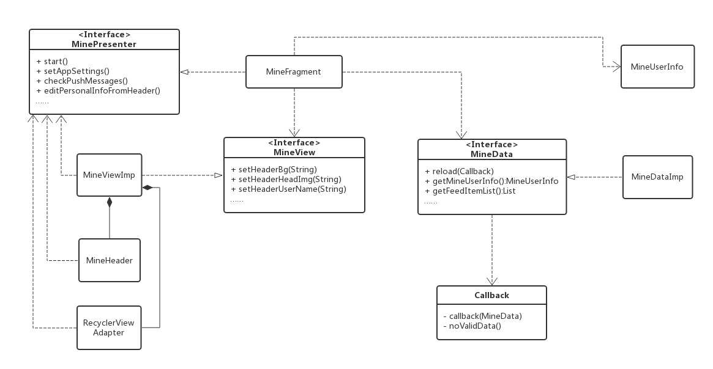

# 个人中心

个人中心用来展示和用户相关的信息展示和信息操作，包括

**展示个人信息：**在个人中心首页（app中*我的*页面）展示了用户的个人信息（昵称，等级，店铺背景），以及其它信息（红包、订单、购物车等）的入口

**修改个人信息** *昵称*、*店铺名称*、*店铺域名*、*店铺简介*、*头像* 及 *店铺背景* 等信息修改

**其它模块的便捷入口** 后台可以配置所有产品需要的、可配置入口在个人中心

## 首页

**MinePresenter** 

- 已实现子类MineFragment

- 方法：

  - *void start():*  View回调方法，View准备好了通过执行start方法通知Presenter。
  - *void setAppSettings():*  打开APP设置页面
  - *void checkPushMessages():*   打开消息中心
  - *void editPersonalInfoFromHeader():*  打开个人信息设置页面，从头像点击进入
  - *void editPersonalInfoFromNickname():*  打开个人信息设置页面，从昵称点击进入
  - *void showStationPage():*  打开会员体系页面
  - *int getWindowStatusBar():* 获取状态栏高度

**MineData**

- 已实现子类：MineDataImp
- 内部借口：DataCallback
  - *void callback(MineData):* 有新数据加载后回调
  - *void noValidData():* 没有新数据

- 方法：
  - *void reload(Callback):*  刷新数据
  - *MineUserInfo getMineUserInfo():* 获取用户信息数据
  - *List getFeedItemList():* 获取feed流数据集合
  - *Boolean isShowGuide():* 是否弹出引导页面
  - *void setShowGuide(boolean):* 设置是否显示引导页面
  - *int getMessageCount():* 获取未读消息数
  - *void setMessageCount():* 设置未读消息数

**MineView**

- 已实现子类：MineViewImp
- 方法：略

## 个人信息编辑

**Presenter**

- 已实现子类：MineEditActivity
- 方法：
  - *start():*  View回调方法，View准备好了通过执行start方法通知Presenter。
  - *editNickname():*  编辑用户昵称
  - *editShopName():*  编辑店铺名称
  - *editShopIntro():*  编辑店铺简介
  - *editShopUrl():*  编辑店铺域名
  - *updateHead(View)*  更新头像
  - *updateShopName(String):*  更新店铺名称
  - *updateShopIntro(String):*  更新店铺简介
  - *updateShopDomain(String):*  更新店铺域名
  - *updateShopBg(View):*  更新店铺背景
  - *setSaveBtnEnable(boolean):*  设置保存按钮状态是否可用

**View**

- 已实现子类：
  - MineEditIndexFragment
  - MineEditNicknameFragment
  - MineEditShopNameFragment
  - MineEditShopIntroFragment
  - MineEditShopUrlFragment
- 方法：
  - *setHead(String):* 设置头像
  - *setNickname(String):*  设置昵称
  - *setShopName(String):*  设置店铺名称
  - *setShopIntro(String):*  设置店铺简介
  - *setShopDomain(String):*  设置店铺域名
  - *setShopBg(String):*  设置店铺背景
  - *isActive():*  是否存活
  - *onSave():*  点击保存时调用

